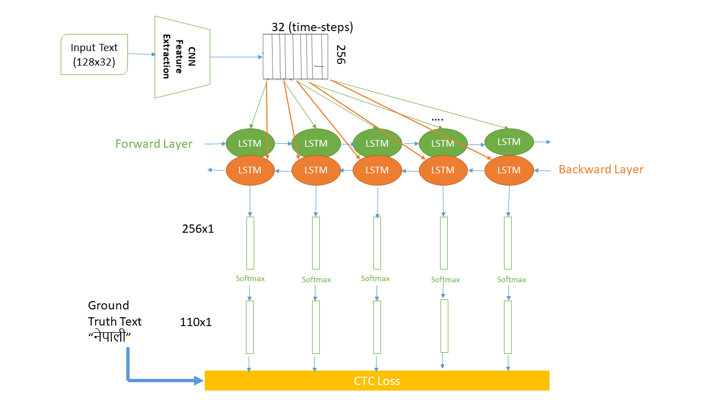
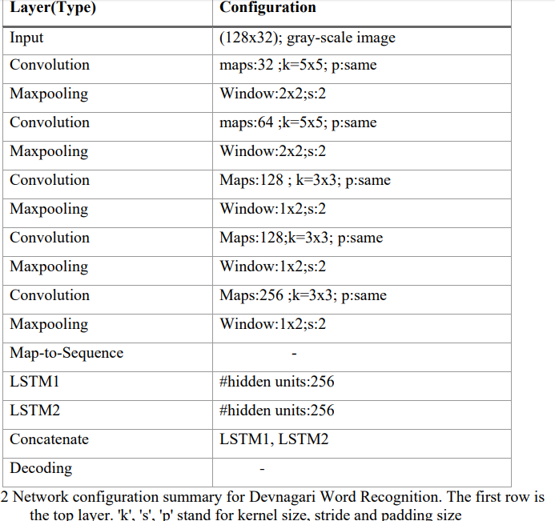

# Devnagari Handwritten Word Recongition
### Description
Use Convolutional Recurrent Neural Network to recognize the Handwritten Word text image without pre segmentation into words or characters. Use CTC loss Function to train.

## <i> Basic Intuition on How it Works.

* First Use Convolutional Recurrent Neural Network to extract the important features from the handwritten line text Image.
* The output before CNN FC layer (512x100x8) is passed to the BLSTM which is for sequence dependency and time-sequence operations.
* Then CTC LOSS [Alex Graves](https://www.cs.toronto.edu/~graves/icml_2006.pdf) is used to train the RNN which eliminate the Alignment problem in Handwritten, since handwritten have different alignment of every writers. We just gave the what is written in the image (Ground Truth Text) and BLSTM output, then it calculates loss simply as `-log("gtText")`; aim to minimize negative maximum likelihood path.
* Finally CTC finds out the possible paths from the given labels. Loss is given by for (X,Y) pair is:  pair")
* Finally CTC Decode is used to decode the output during Prediction.
</i>

### Detail Project Workflow

1. Input image is 128x32 (grayscale) pass to the model in a batch size.
2. Pass through the 5 layer of CNN which extracts the 256 feature maps of size 32x1.
3. Then the extracted feature vectors are passed to the 2 layer of LSTM form one BLSTM to maintain text dependencies efficiently from both direction which output is 32x110 i.e time-steps x number_of_classes.
4. CTC Loss function is used to train the LSTM without need of transcription provided the correct spare ground truth texts and numeric value.
5. Finally CTC decode is used on to decode the LSTM output and predict the written text in digital Image.

NOTE: number of classes found =110 during parsing groud truth text of the images and save in model/charlist

The model detail found 


# Requirements
1. Tensorflow 1.8.0
2. Flask
3. Numpy
4. OpenCv 3

#### Dataset Used
IIT Devnagari Word Dataset. You can download it from [Devanagiri Dataset (IIIT-HW-Dev)](https://cvit.iiit.ac.in/research/projects/cvit-projects/indic-hw-data).

###### The trained model CER=12.988% and trained on IIT Devnagari Word dataset with some additional created dataset.

To Train the model from scratch
```markdown
$ python main.py --train
```
To validate the model
```markdown
$ python main.py --validate
```
To Prediction
```markdown
$ python main.py
```

Run in Web with Flask
```markdown
$ python upload.py
Validation character error rate of saved model: 12.988031%
Python: 3.6.4 |Anaconda, Inc.| (default, Mar 12 2018, 20:20:50) [MSC v.1900 64 bit (AMD64)]
Tensorflow: 1.8.0
Init with stored values from ../model/snapshot-2
Recognized: "होसले"
Probability: 0.7297366
```
# DEMO


# Further Improvement
* Better Image preprocessing such as: reduce background noise to handle real time image more accurately.
* Use Data Augmentation before training to improve accuracy.
* Use Deep Layers of BLSTM or can be [MDLSTM](http://www.tbluche.com/files/icdar17_sar.pdf) but again you have to compromise with training complexity and overfitting.
* Use Better [CTC Decoder](https://github.com/githubharald/CTCDecoder) such as [Word Level Decoder](https://ieeexplore.ieee.org/document/8583770) and better Language model for decoder output correction.


<i>This is a small effort to make handwritten devnagari word recognition possible with deep learning in a word level. It can be use to a [line level recognition](https://github.com/sushant097/Handwritten-Line-Text-Recognition-using-Deep-Learning-with-Tensorflow) with few layers added on it and needs line level image data. This can be extended to the Nepali Handwritten Recognition with accessible to Nepali Dataset.
You can also use [Word Segmentation](https://github.com/githubharald/WordSegmentation) of the Line level Images and pass it in a batch of images for prediction.
You can try to make handwritten recognition on any language too.</i>
This project gain lots of motivation from [githubharald/SimpleHTR](https://github.com/githubharald/SimpleHTR) Repo.

# Citation
If you use any part of this project in your work, please cite:

```bash
@techreport{Devnagari-handwritten-word-recognition-2019,
  title={Devnagari Handwritten Word Recognition},
  author={Gautam Sushant},
  institution={Tribhuvan University},
  year={2019}
}
```
For the completion of the eighth semester in the Computer Science program at Tribhuvan University. July 2019.


